# reacted-wheel-pendulum
This repository contains the development of a one-axis reacted-wheel inverted pendulum. The system uses a single reacted wheel for stabilization and is controlled by an PID controller on an ESP32 to integrates an IMU sensor and a BLDC motor. To optimize the PID controller parameters, ACO and GWO algorithms were implemented and simulated in Matlab.

## Demo

<p align="center">
  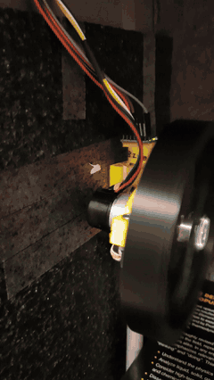
</p>

The prototype stays upright on the reaction wheel and recovers when it is pushed by hand.
Full video (58 s): [media/1axis_test.mp4](media/1axis_test.mp4)

## Results

Simulation results from the project report ([Report/Report_DoAn1_final.pdf](Report/Report_DoAn1_final.pdf), chapters 3 and 4).

| | Kp | Ki | Kd |
|---|---|---|---|
| Best PID gains found by GWO | 77.2913 | 16.8036 | 6.51953 |
| Best PID gains found by ACO | 452.46 | 22.12 | 9.81 |

> These results come from the original 2023 runs: a single 3-gain PID on the pendulum,
> GWO with 20 wolves x 50 iterations in [0.1, 100], and a discrete ACO (10 ants x 10
> iterations, 1000 candidate PID sets in [0.1, 500]). That ACO code is not in this
> repository. The scripts in `pid-tuning/` tune 6 gains, include a fix to the GWO
> position update, and use ACO_R, so re-running them will give different numbers.

### GWO

| Pendulum angle q<sub>C</sub> | Wheel angle q<sub>W</sub> | Motor torque |
|---|---|---|
| 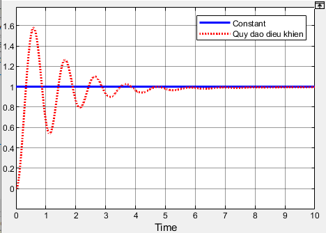 | 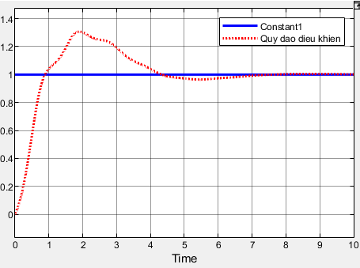 | 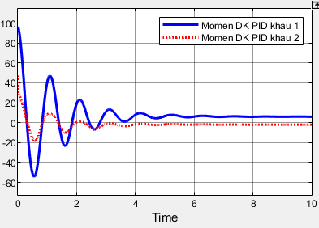 |
| **Error q<sub>C</sub>** | **Error q<sub>W</sub>** | **Wheel rotation** |
| 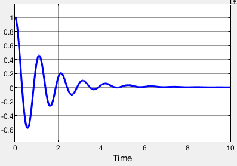 | 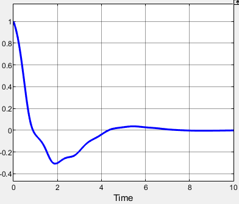 | 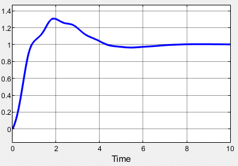 |

### ACO

| Balancing: pendulum position | Balancing: wheel position |
|---|---|
| 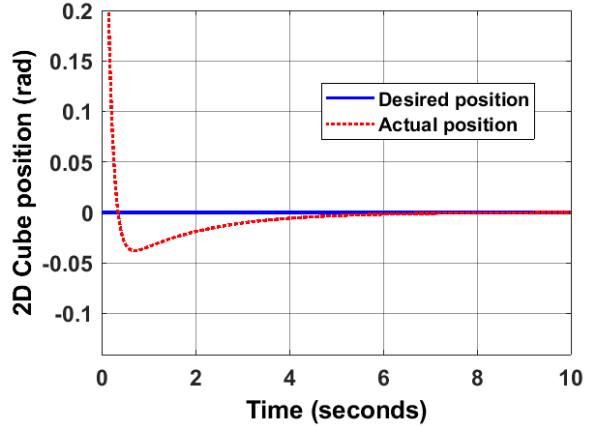 | 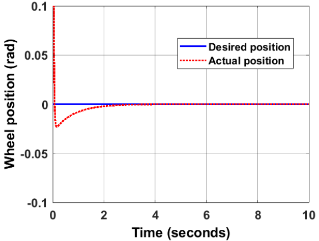 |
| **Balancing: position error** | **Trajectory tracking** |
| 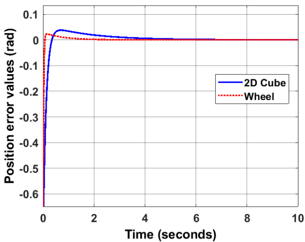 | 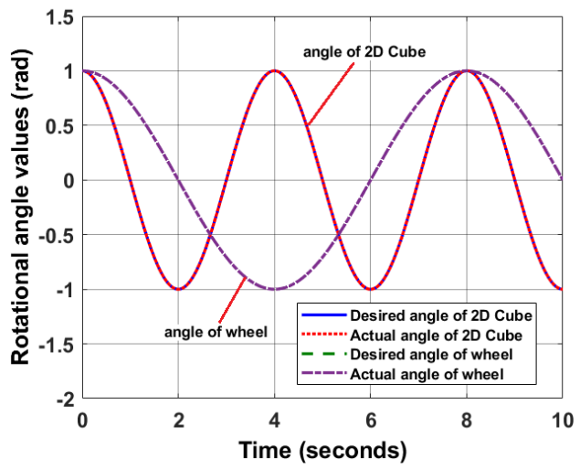 |

## Folder structure

```
reacted-wheel-pendulum/
├── system-model/            Pendulum model and simulation
│   ├── pendulum.m           State-space model, poles/zeros, controllability/observability
│   ├── RWIPSimulink1axis.slx  Simulink model of the reaction-wheel pendulum
│   └── plot.m               Plot the tilt angle after a simulation
├── media/                   Demo video, demo GIF and result plots (results/)
├── pid-tuning/              PID gain optimisation (MATLAB + Simulink)
│   ├── common/              Shared by both algorithms
│   │   ├── initialization.m Random initial population inside [lb, ub]
│   │   ├── parameter.m      Plant parameters used inside the Simulink models
│   │   ├── position/        Position control  (vi tri):  DK_Vitri_Control_PID.slx,  costFunc_vitri.m
│   │   └── trajectory/      Trajectory tracking (quy dao): DK_Quydao_Control_PID.slx, costFunc_Quydao.m
│   ├── GWO/                 Grey Wolf Optimizer
│   │   ├── runGWO_Vitri.m
│   │   └── runGWO_Quydao.m
│   └── ACO/                 Ant Colony Optimization for continuous domains (ACO_R)
│       ├── runACO_Vitri.m
│       └── runACO_Quydao.m
├── firmware/                Arduino test sketches
│   ├── MotorControlArduino/ Open-loop motor test (L298N, potentiometer, direction button)
│   └── KalmanFilterMPU/     MPU6050 accelerometer + 1-D Kalman filter
├── References/              Papers (Cubli, inertia-wheel cubes, ...)
├── Report/                  Project report, schematic, slides
└── archive/                 Original .rar backups and old Simulink build caches
```

## Running the PID tuning

Open MATLAB (R2020b or newer) and run one of the scripts, e.g.

```matlab
run('pid-tuning/ACO/runACO_Vitri.m')
```

Each script adds `pid-tuning/common` and the matching `position/` or `trajectory/`
folder to the MATLAB path, so it can be run from any folder.

Both algorithms tune the same 6 gains `[Kp1 Kd1 Ki1 Kp2 Kd2 Ki2]` in the range
`[0.1, 100]`, write them to the base workspace (read by the Gain blocks of the
Simulink model), simulate, and minimise

```
fitness = w*cost1 + (1-w)*cost2,   w = 0.5
```

| Model | cost1 (joint 1) | cost2 (joint 2) |
|---|---|---|
| Position (`Vitri`)     | ITAE | ITAE |
| Trajectory (`Quydao`)  | IAE  | ITAE |

Unstable gains (simulation diverges) get `cost = inf`.

| Setting | Position | Trajectory |
|---|---|---|
| GWO: wolves x iterations | 20 x 50 | 50 x 100 |
| ACO: archive size, ants x iterations | 20, 20 x 50 | 50, 50 x 100 |

Both use about the same number of simulations, so their convergence curves and
final costs can be compared directly.

After a run, the best gains are left in the workspace (`Kp1 ... Ki2`), the
convergence curve is plotted and the reference/output of both joints are shown.

### GWO
Grey Wolf Optimizer (Mirjalili et al., 2014). The three best wolves (alpha, beta,
delta) lead the pack; the coefficient `a` decreases from 2 to 0 to move from
exploration to exploitation.

### ACO
ACO_R (Socha & Dorigo, 2008). A sorted archive of the best solutions acts as the
pheromone. Each ant picks a guide solution from the archive (rank-based
probability controlled by `q`) and samples each gain from a Gaussian around it
(width scaled by `zeta`). New ants and the archive are merged and the best ones
are kept.
